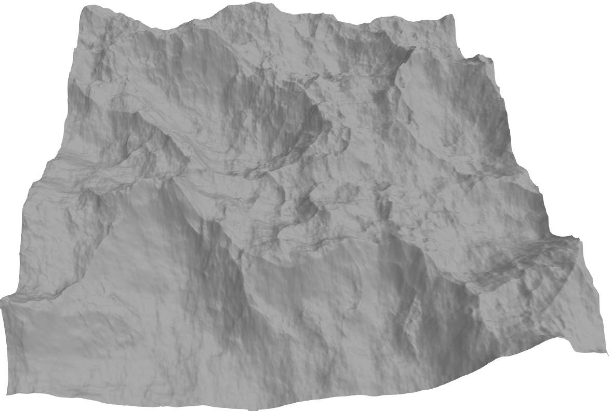
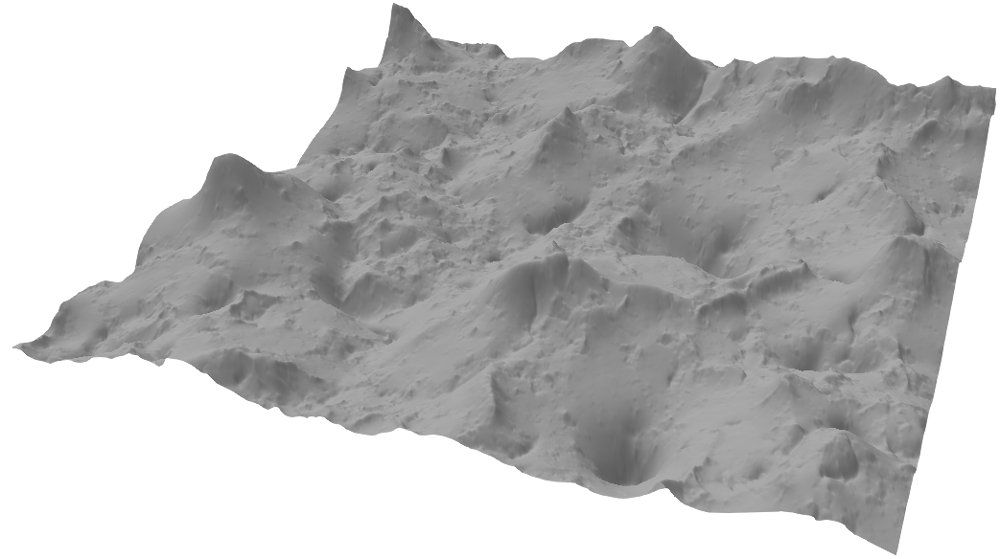
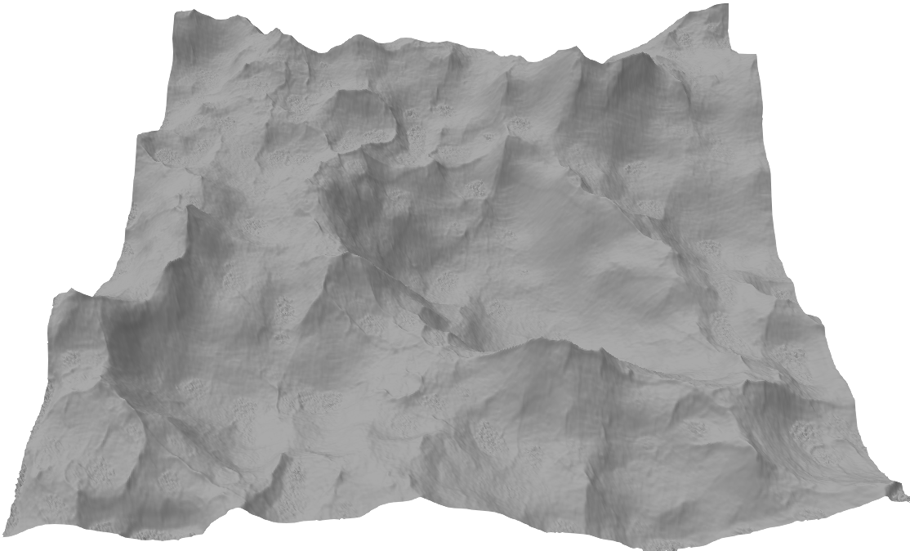
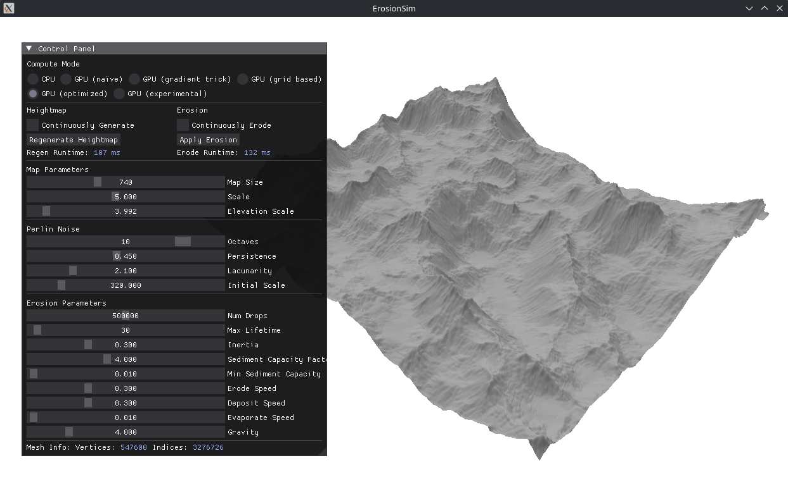

# ErosionSim

This project recreates the effect that rainfall has on mountains by simulating water droplets and the resulting sediment movement onto a heightmap. The goal is to make proceduraly generated terrain look more natural. A CPU implementation as well as multiple different GPU implementations for the generation of the heightmap and the simulation of erosion are provided and can be benchmarked against each other.

<p align="center">
  
  
</p>

<p align="center">(left image: before erosion, right image: after erosion (5k steps))</p>

## Setup

```bash
mkdir build
cmake -S . -B build && cmake --build build -j
./build/ErosionSim
```
Note that this requires CMake, a C++17 toolchain, git + network access to fetch dependencies (glad and glfw), OpenGL system libraries, an NVIDIA GPU (tested and optimized for the NVIDIA GeForce RTX 3060 Ti), the CUDA toolkit + NVCC.

---

Alternatively use the dockerfile, but you'll still need the NVIDIA container toolkit and forward X11 from host:
```bash
docker build -t erosion-sim .
xhost +local:docker
docker run --gpus all -e DISPLAY=$DISPLAY -v /tmp/.X11-unix:/tmp/.X11-unix erosion-sim
```

## Structure

```bash
.
├── deps/   # 3-rd party dependancies (imgui and FastNoiseLite)
├── imgs/   # Images for this markdown file
├── shaders/    # GLSL vertex and fragment shader
└── src/
    ├── CPU/    # CPU implementation of heightmap generation and erosion
    ├── GPU0/   # Naïve GPU implementation
    ├── GPU1/   # Gradient trick GPU implementation
    ├── GPU2/   # Optimized GPU implementation
    ├── GPU3/   # Experimental GPU implementation (has some visual artefact problems)
    └── GPUgridBased/   # Simplified grid based GPU implementation

```
The gradient trick implementation follows this article: [value noise derivatives](https://iquilezles.org/articles/morenoise/)

## Optimization Strategies
While the naïve GPU implementation does not include any optimization strategies, the optimized GPU implementation has tried to do the following to reduce the runtime of its kernel:  
  
**thread coarsening**  
handle multiple droplets per thread. This had a positive impact on performance.  
**memory locality**  
 droplets are grouped spatially so that threads in a block work on nearby map cells. One block handles one tile and the thread of that block initialize their droplets inside the bounds of that tile. This had a very positive impact on performance.  
**pinned host memory**  
use cudaMallocHost to pin the memory location of the heightmap. This had almost no effect on performance.  
**persistent allocations**  
reusing device allocations across multiple calls for stuff like the heightmap and brush weights / vertex offsets. This had almost no effect on performance.  
**shared memory**  
blocks read and write into the shared memory of their tile first before writing it all to global memory to reduce global atomic adds. While this has a positive impact on performance (and visibly better memory utilization in Nsight), it also creates visual artifacts in the form of seam lines on low-resolution maps (you can see this with the experimental GPU implementation).  
**occupancy control**  
the kernel launch parameters are computed using the given parameters in an attempt to maximise occupancy and memory / compute throughput. This had a slight positive impact on performance.  
**warp divergence**  
attempts to minimize control-flow splits in the threads of a warp by using clamps and reducing unneccesary checks. This had no noticable impact on performance (as the compiler probably already did most optimization here anyways)  
**streams**  
CUDA streams were considered but ultimately not used as there is almost no oportunity for overlaping transfers with computation. The base hydraulic erosion algorithm is not tileable.

Additionally, two other methods of simulating hydraulic erosion have been implemented, that do not rely on droplet simulation. Gradient trick calculates the gradient at each point on the heightmap and smoothes out steep ledges, creates flat areas as well as more rough areas for erosion-like effects. The grid-based GPU implementation does not use droplets, but calculates and applies ingoing / outgoing water flow per grid tile in a multi-step process. Both of these alternate ways of mimicing hydraulic erosion are more suited for running on the GPU, but also create visually different results (and I do prefer the droplet simulation results a bit more).

<p align="center">
  
  
</p>
<p align="center">(left image: gradient trick, right image: tile based)</p>
  
Interesting optimizations that I have not looked into is combining a simple pass that simulates droplets with a more GPU-friendly alternative, to keep the iconic ridges in the mountainsides while benifiting from the speed of the alternate algorithms.

<center></center>